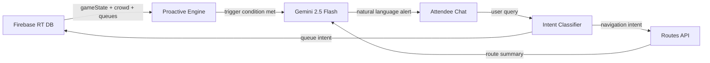

# StadiumIQ — Proactive Stadium Concierge

> An AI-powered assistant that predicts attendee needs at large-scale sporting venues — before they even ask.

## 🔗 Live Demo
[https://github.com/namanraii/StadiumIQ](https://github.com/namanraii/StadiumIQ)

---

## 💡 The Vision

StadiumIQ reduces "time-to-seat" and post-game exit delays by proactively routing 60,000+ attendees based on real-time crowd density and game state. Attendees never need to search for help — the assistant finds them.

It leverages Google's AI, Maps, and Firebase ecosystem to deliver a seamless, context-aware venue experience through a split-screen web interface: a live crowd map on the left, an intelligent chat assistant on the right.

---

## 🏟️ Problem Statement

Large sporting events face systemic challenges:
- **Crowd bottlenecks** at gates and concession stands
- **Long queue wait times** without real-time guidance
- **Poor exit coordination** at match end
- **Reactive (not proactive)** venue staff and information systems

StadiumIQ solves this by combining live sensor data, game clock awareness, and AI to send unprompted, timely alerts.

---

## 🏗️ Architecture

```
Firebase Realtime DB ──► Proactive Engine ──► Gemini 2.5 Flash ──► Chat UI
       │  (gameState, crowd,       │  (trigger on Q4/halftime)         ▲
       │   gates, queues)          └────────────────────────────────────┘
       │                                                           User Query
       └──► Maps JS API (live crowd overlay)          Intent Classifier
                                                           │
                                               Routes API (walking path)
```

**Logic Flow:**


---

## ☁️ Google Services Used

| Service | Role | Why Chosen |
|---|---|---|
| **Gemini 2.5 Flash** | NLU + response generation | Best latency for real-time conversational use |
| **Firebase Realtime DB** | Live gameState, crowd, queue data | `onValue()` eliminates polling entirely |
| **Maps JavaScript API** | Venue map + crowd density overlay | Visual spatial context for attendees |
| **Routes API** | Crowd-aware walking directions | Separate from Maps JS for optimized routing |
| **Cloud Run** | Containerized deployment | Scalable static hosting via Nginx |

---

## ✨ Features

- **🚨 Proactive Exit Warning** — Detects Q4 ending + crowded exits → auto-suggests alternate routes unprompted
- **🍟 Halftime Concession Guidance** — Predicts queue spikes before they happen and routes to shortest queue
- **🚪 Gate Capacity Routing** — Real-time colour overlay (Low/Medium/High) + least-crowded gate suggestion
- **🤖 Venue Concierge** — Ask anything: restrooms, first aid, schedule, parking, lost & found

---

## 🚀 How to Run Locally

```bash
# 1. Clone the repository
git clone https://github.com/namanraii/StadiumIQ.git
cd StadiumIQ

# 2. Configure API keys
#    Open config.js and replace placeholder values with your real API keys

# 3. Seed Firebase Realtime Database
#    Import data/firebase-seed.json into your Firebase Realtime DB

# 4. Start a local static server
python3 -m http.server 3000
# Then open http://localhost:3000
```

---

## 🧪 How to Run Tests

```bash
npm install
npm test
# Remove node_modules before committing!
```

---

## 📋 Assumptions

- Venue floor plan is mocked via `data/stadium.json`
- Queue and crowd data is seeded in Firebase to simulate live IoT sensor updates
- Updating `gameState.quarter` or `gameState.minutesLeft` in Firebase triggers proactive messages in real time (demonstrable live)
- In production, Firebase would be populated by real IoT sensors, ticketing APIs, and POS system feeds

---

## 🔒 Security

- **No API keys committed** — Keys are stored in `.env` (gitignored) and loaded via `config.js`
- **Firebase rules**: Read-only access for all public collections
- **Input sanitization**: HTML characters stripped, 300-character limit enforced on all user input
- **Maps key restricted**: Limited to specific domain referrers to prevent unauthorized usage

---

## 📁 Project Structure

```
StadiumIQ/
├── index.html          # Main SPA with accessible layout (ARIA roles)
├── config.js           # Runtime environment variable injection
├── css/
│   └── style.css       # Premium glassmorphic light-mode UI
├── js/
│   ├── app.js          # Main orchestrator
│   ├── gemini.js       # Gemini API client (context-enriched)
│   ├── firebase.js     # Realtime DB listeners
│   ├── maps.js         # Google Maps + crowd overlay
│   ├── routes.js       # Routes API integration
│   ├── intent.js       # Regex-based intent classifier
│   └── proactive.js    # Game-clock-aware push alert engine
├── data/
│   ├── stadium.json    # Venue layout (gates, food, restrooms)
│   └── firebase-seed.json # Demo sensor data for Firebase
├── tests/              # Jest unit tests
├── Dockerfile          # Nginx container for Cloud Run
└── nginx.conf          # Port 8080 config for Cloud Run
```
